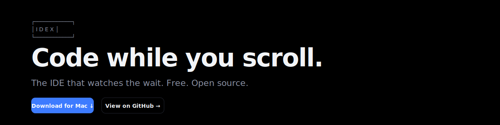

<div align="center">
  

  <p>
    <a href="https://github.com/Manueldav2/idex/actions/workflows/ci.yml"></a>
    
    
    
  </p>
</div>

# IDEX — Interactive Dev Experience

> The IDE that watches the wait. Code while you scroll.

IDEX is a Chromium-shelled desktop app that hosts your coding agent (Claude Code, Codex, Freebuff) inside a beautiful cockpit. While the agent generates a response, IDEX foregrounds a TikTok-energy, picture-to-picture scroll feed of media (videos, images, threads from X) that's contextually relevant to what you just asked the agent to do.

When the agent finishes, the cockpit reclaims the main screen and the feed retreats to a peek strip on the edge.

**Free. Open source (MIT). Ad-supported via [trygravity.ai](https://trygravity.ai/).**

---

## ✨ Why IDEX

When a developer prompts a coding agent, they wait 5–60 seconds for the response. During that wait they almost universally context-switch to Twitter/X, Discord, or YouTube — losing focus and rarely returning with information that's relevant to what they were working on.

**IDEX intercepts the wait.** A built-in *Curator* agent reads your conversation in real time and pulls a contextual feed from X — *adjacent* topics, not just direct keyword matches. Working on cold-email infra? You get deliverability tips, SPF/DKIM walkthroughs, IP-warming threads. Wiring up Stripe webhooks? You get idempotency patterns and signature-verification footguns.

---

## 🎯 v1.0 capabilities

- 🖥️ **Native macOS desktop app** (Apple Silicon + Intel)
- 🤖 **Three coding agents on day one** (in phased rollout): Claude Code, Codex, Freebuff
- 🎨 **moda.dev-inspired cockpit** — no chat bubbles, no avatars, just clean conversation
- 📜 **Picture-to-picture feed** sourced from X via Composio
- 🧠 **GLM-4.6 curator** predicts adjacent topics from your conversation
- 🎬 **TikTok-energy scroll** with picture-to-picture layout dynamic
- 🔓 **Open source MIT** — bring your own API keys, tokens at cost

---

## 📦 Repo layout

```
idex/
├── apps/
│   ├── desktop/            # Electron + React desktop app
│   └── landing/            # Marketing site (idex.dev)
├── packages/
│   ├── types/              # Shared TS types (IPC, Card, ContextEvent)
│   ├── adapters/           # Agent CLI adapters (Claude Code, Codex, Freebuff)
│   └── curator/            # Curator pipeline (GLM-4.6 + ranking)
├── docs/
│   ├── specs/              # Design specifications
│   └── plans/              # Implementation plans
└── references/             # 21st.dev / Aceternity component originals
```

## 🚀 Getting started (development)

**Prerequisites:**
- Node.js 20+
- pnpm 10+
- macOS 13+ (for desktop app)
- Claude Code CLI installed (`npm install -g @anthropic-ai/claude-code`)

```bash
git clone https://github.com/Manueldav2/idex.git
cd idex
pnpm install

# Run desktop app in dev
pnpm dev:desktop

# Run landing site in dev
pnpm dev:landing
```

## 🔑 Configuration

On first launch, IDEX walks you through:
1. Picking your coding agent (Claude Code is the default)
2. Optionally pasting your **OpenRouter** key (for the Curator) — works in starter-feed mode without one
3. Optionally connecting **X** via Composio's hosted OAuth — works in starter-feed mode without one

User config lives at `~/.idex/config.json`. Secrets live in your OS keychain (via [keytar](https://www.npmjs.com/package/keytar)).

---

## 🗺️ Roadmap

- **Phase 1** (this build) — Foundation: Electron shell, Claude Code adapter, cockpit UI, settings, packaging
- **Phase 2** — Curator + Composio + Feed pane (the magic moment)
- **Phase 3** — Codex + Freebuff adapters, landing site, Mac notarization, public beta
- **v1.1** — Trygravity.ai ad slots enabled, telemetry-tuned curator, Reddit + YouTube feed sources
- **v2** — Linux + Windows, multi-tab sessions, mobile companion

---

## 🤝 Contributing

PRs welcome. See `docs/specs/` for design context and `docs/plans/` for in-flight work.

## 📄 License

MIT © 2026 [Manny](mailto:info@devvcore.com)
